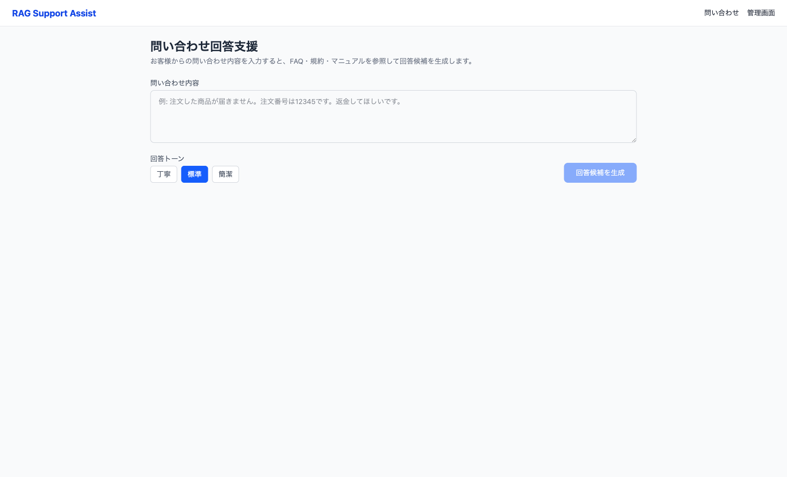

# RAG Support Assist

カスタマーサポート回答支援AI - FAQ・規約・マニュアル・過去問い合わせを参照し、回答候補を生成するRAGサービス



## サービス概要

| 項目 | 内容 |
|------|------|
| 目的 | 回答品質の均一化、返信時間短縮、新人支援、規約確認工数削減 |
| 対象ユーザー | CS担当、コールセンターOP、SV、QA担当、EC運営 |

### 主な機能

- 問い合わせ文入力 → RAGで回答候補を生成
- FAQ / 規約 / マニュアル / 過去問い合わせの参照
- 回答トーン切替（丁寧 / 標準 / 簡潔）
- 参照した根拠文書の表示
- エスカレーション要否の判定
- 管理画面での文書アップロード・削除

## システム構成

```
[ブラウザ] → [Next.js (port 3000)] → [FastAPI (port 8000)] → [OpenAI API]
                                            ↓
                                     [ChromaDB (組み込み)]
```

## 技術スタック

| レイヤー | 技術 |
|---------|------|
| フロントエンド | Next.js 15, React 19, Tailwind CSS 4 |
| バックエンド | Python, FastAPI |
| ベクトルDB | ChromaDB (PersistentClient) |
| LLM / Embedding | OpenAI API (gpt-4o-mini / text-embedding-3-small) |

## 画面一覧

| 画面 | パス | 説明 |
|------|------|------|
| 問い合わせ入力 | `/` | メイン画面。問い合わせ入力＋回答候補表示＋根拠表示 |
| 管理画面 | `/admin` | 文書のアップロード・一覧・削除 |

## ディレクトリ構成

```
rag-support-assist/
├── backend/
│   ├── app/
│   │   ├── main.py              # FastAPIエントリポイント
│   │   ├── models.py            # Pydanticモデル
│   │   ├── routers/
│   │   │   ├── query.py         # 問い合わせAPI
│   │   │   └── documents.py     # 文書管理API
│   │   └── services/
│   │       ├── chunker.py       # テキストチャンク化
│   │       ├── embeddings.py    # Embedding生成
│   │       ├── vectorstore.py   # ChromaDB操作
│   │       └── rag.py           # RAG回答生成
│   ├── requirements.txt
│   └── .env.example
├── frontend/
│   ├── src/
│   │   ├── app/
│   │   │   ├── layout.tsx       # 共通レイアウト
│   │   │   ├── page.tsx         # メイン問い合わせ画面
│   │   │   └── admin/page.tsx   # 管理画面
│   │   └── components/
│   │       ├── AnswerDisplay.tsx # 回答候補表示
│   │       └── SourceCard.tsx   # 参照ソース表示
│   ├── package.json
│   └── .env.local.example
├── sample_data/                 # サンプル文書
│   ├── faq.txt
│   ├── terms.txt
│   ├── manual.txt
│   └── history.txt
└── README.md
```

## API設計

### 問い合わせ

```
POST /api/query
Body: { "query": "問い合わせ文", "tone": "standard" }
Response: { "answer": "回答候補", "sources": [...], "should_escalate": false }
```

tone: `"polite"` (丁寧) / `"standard"` (標準) / `"concise"` (簡潔)

### 文書管理

```
POST   /api/documents/upload   # 文書アップロード (multipart/form-data)
GET    /api/documents          # 文書一覧取得
DELETE /api/documents/{doc_id} # 文書削除
GET    /api/health             # ヘルスチェック
```

## ローカル起動方法

### 前提条件

- Python 3.11+
- Node.js 18+
- OpenAI APIキー

### 1. バックエンド起動

```bash
cd backend

# 仮想環境作成
python -m venv venv
source venv/bin/activate  # Windowsは venv\Scripts\activate

# 依存パッケージインストール
pip install -r requirements.txt

# 環境変数設定
cp .env.example .env
# .env を編集して OPENAI_API_KEY を設定

# サーバー起動
uvicorn app.main:app --reload --port 8000
```

### 2. フロントエンド起動

```bash
cd frontend

# 依存パッケージインストール
npm install

# サーバー起動
npm run dev
```

### 3. サンプルデータ投入

管理画面 (http://localhost:3000/admin) から `sample_data/` 内のファイルをアップロードしてください。

| ファイル | カテゴリ |
|---------|---------|
| faq.txt | FAQ |
| terms.txt | 利用規約 |
| manual.txt | マニュアル |
| history.txt | 過去問い合わせ |

### 4. 問い合わせテスト

http://localhost:3000 にアクセスし、以下のような問い合わせを入力してください。

## サンプル問い合わせ例

| 問い合わせ | 期待される動作 |
|-----------|--------------|
| 注文した商品が届きません。注文番号はA2345です。 | FAQ＋過去履歴を参照し、追跡確認→再配送の案内を生成 |
| セール品を返品したいのですが可能ですか？ | 規約を参照し、セール品は返品対象外であることを案内 |
| 届いた商品が壊れていました。返金してください。 | FAQ＋規約＋マニュアルを参照し、写真提出→交換or返金の案内を生成 |
| パスワードリセットのメールが届きません | FAQ＋過去履歴を参照し、迷惑メール確認→別アドレス確認の案内 |
| 5万円の商品を返金してほしい | 規約＋マニュアルを参照し、高額返金のためエスカレーション推奨を表示 |

## 将来拡張案

### Phase 2: 運用機能強化
- ユーザー認証・権限管理（オペレーター / SV / 管理者）
- 回答履歴の保存・検索
- 回答のフィードバック機能（良い/悪い）
- 回答テンプレート管理

### Phase 3: AI機能拡張
- PDF / Word / Excel ファイル対応
- 自動カテゴリ分類
- 感情分析によるクレーム検知
- 多言語対応
- ストリーミング回答生成

### Phase 4: 統合・分析
- チャットツール連携（Slack, Teams）
- CRM連携（Salesforce, Zendesk）
- 対応品質ダッシュボード
- 回答精度の自動評価
- A/Bテスト機能

### Phase 5: エンタープライズ
- マルチテナント対応
- SSO / SAML認証
- 監査ログ
- SLA管理
- オンプレミスLLM対応
